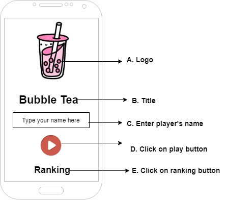
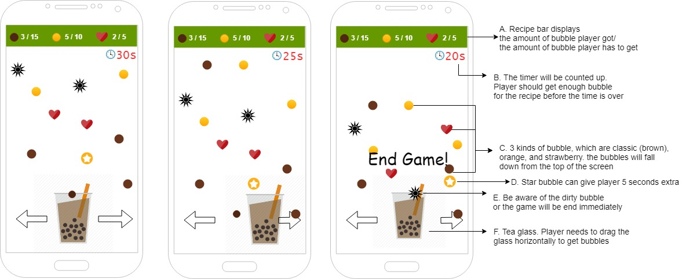
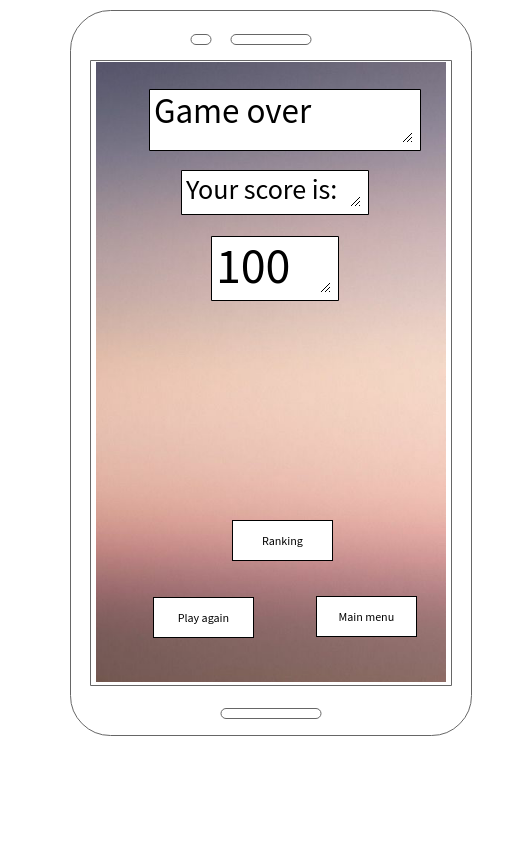
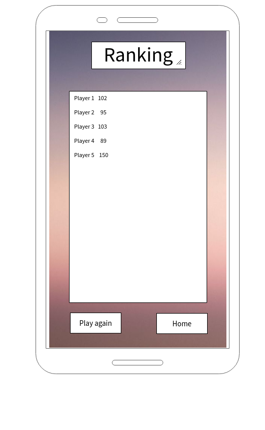

## Functional design

`Bubble Tea` is a game for all tea lovers. Its goal is to make your own bubble tea according to the recipe within a certain amount of time. There are three main kinds of bubbles in the recipe, which are classic, orange and strawberry. The player needs to drag the bubble glass horizontally to get enough bubbles for the recipe before the time is over. There will be some special bubbles which can give the player extra time, or some dirty bubbles which end the game immediately. 
### Example menu screen

This is the main activity. It shows the title screen. The player should type their name and then can start the actual game by pressing the play button. Pressing on ranking will redirect you to the ranking screen. 

### Example game view screen

This section explains (part of) the actual game. There are different game objects that can be encountered in the game world. Some game objects(bubbles) can be collected in the glass object. The player should collect a specific number of bubbles of some kinds to finish the game. Some bubbles have other effects as well.

If you get a star bubble, you can have extra time as 5 seconds.
However, if you get a dirty bubble, the game would be over immediately.

### Example game over screen 

This screen displays how the screen looks like when the game finishes. It shows actual player’s current score. It also offers button to get all players’ ranking to provide player overview of all players. Of course there is possibility to play again with Play again button. Button Home takes player back to main activity. 

 

### Example ranking screen

This screen provides list of all players’ names together with their scores.  There are two buttons. First of them allows player to play again, it takes player back to game view. Second button leads to main activity. 

 

 
