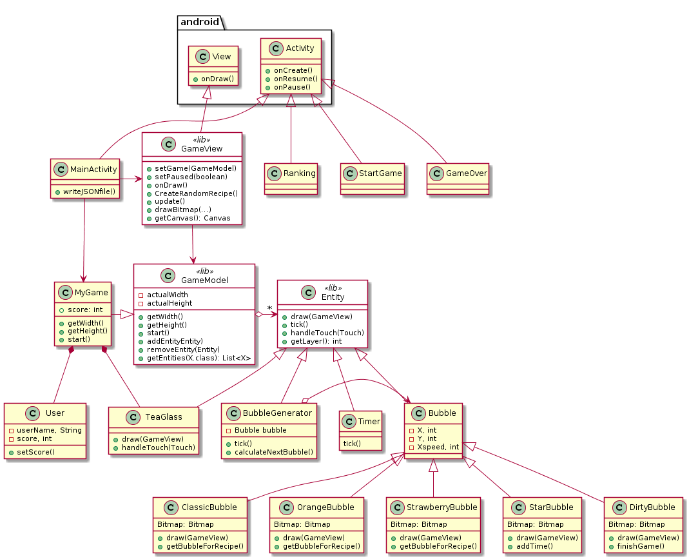

## Technical design


### About this document

This document is written in Markdown using PlantUML for diagrams. To view and edit it from within Android Studio, install the 'Markdown Navigator' plugin.


### Class diagram

This UML class diagram shows the use of the model classes and activities of the game `Bubble Tea`. 

```plantuml

skinparam class {
    BackgroundColor<< lib >> white
}

class MyGame {
    + score: int
    + getWidth()
    + getHeight()
    + start()
}

class MainActivity {

 + writeJSONfile()

}

class TeaGlass {
    + draw(GameView)
    + handleTouch(Touch)
}

class BubbleGenerator{

    - Bubble bubble
    + tick()
    + calculateNextBubble()
}


class Entity<<lib>> {
    + draw(GameView)
    + tick()
    + handleTouch(Touch)
    + getLayer(): int
}

class User{
-userName, String
-score, int
+ setScore()
}


class Bubble{
  
    - X, int
    - Y, int
    - Xspeed, int

}
class ClassicBubble{
Bitmap: Bitmap 
+ draw(GameView)
+ getBubbleForRecipe()
}
class OrangeBubble{
Bitmap: Bitmap 
+ draw(GameView)
+ getBubbleForRecipe()
}
class StrawberryBubble{
Bitmap: Bitmap 
+ draw(GameView)
+ getBubbleForRecipe()
}
class StarBubble{
Bitmap: Bitmap
+ draw(GameView) 
+ addTime()
}
class DirtyBubble{
Bitmap: Bitmap 
+ draw(GameView)
+ finishGame()
}
class Timer{
tick()
}

class GameOver{

}
class Ranking{

}
class StartGame{

}


class GameModel<<lib>> {
    - actualWidth
    - actualHeight
    + getWidth()
    + getHeight()
    + start()
    + addEntityEntity)
    + removeEntity(Entity)
    + getEntities(X.class): List<X>
}

class GameView<<lib>> {
    + setGame(GameModel)
    + setPaused(boolean)
    + onDraw()
    + CreateRandomRecipe()
    + update()
    + drawBitmap(...)
    + getCanvas(): Canvas
}


GameModel o-> "*" Entity
BubbleGenerator o-> Bubble

GameView --> GameModel

MyGame -|> GameModel
MyGame *-- TeaGlass
MyGame *-- User


Entity <|-- TeaGlass
Entity <|-- Timer
Entity <|-- BubbleGenerator

Entity <|-- Bubble
Bubble <|-- ClassicBubble
Bubble <|-- OrangeBubble
Bubble <|-- StrawberryBubble
Bubble <|-- StarBubble
Bubble <|-- DirtyBubble


MainActivity --> MyGame

MainActivity -> GameView


class android.View {
    + onDraw()
}
class android.Activity {
    + onCreate()
    + onResume()
    + onPause()
}
android.Activity <|-- StartGame
android.Activity <|-- GameOver
android.Activity <|-- Ranking
android.Activity <|-- MainActivity 
android.View <|-- GameView

```



### Class diagram description

 The model classes:
 - `Bubble` class -  provides the position and the speed of the bubble object;
 - `Classic/Orange/Strawberry/Star/Dirty Bubble` class - provides a particular bubble image `draw()` method and methods `getBubbleForRecipe()` - to add a bubble for the recipe, `addTime()` - to get some extra time, `finishGame()` - to stop the game immediately;
 - `BubbleGenerator` class - generate new bubbles, in random positions;
 - `Timer` class - counts the time up, from one to the limit or to the moment that the game ends; 
 - `TeaGlass` class - provides an image of the glass of tea `draw()`, handles the touch of the user `handleTouch()`;
 - `User` class - stores the name and the score of users, updates the score `setScore()`;
 - `MyGame` class - gets the height `getHeight()` and width `getWidth()` to generate the `GameView`, necessary to play game `start()` and keeps tract on the score;
 


Go to the [library documentation](library-documentation.md) to check the library classes reference.